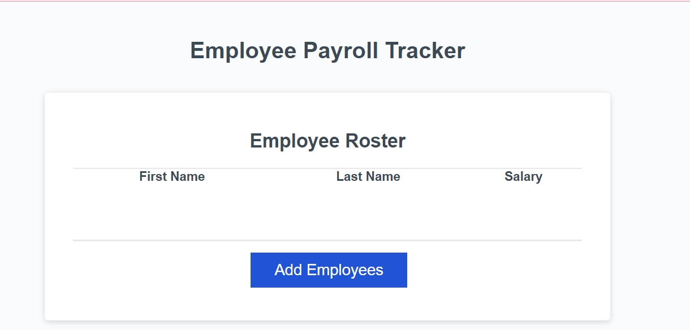

# MY PAYROLL TRACKER

## DESCRIPTION 

The payroll tracker is an interactive website where employers 
would be able to add employees informations such as name, 
last name and salary. Once the information had been added, then they'll
be able to check the console and see the average salary of the employees
in the corporation. Also, they'll be able to choose a random employee 
amoung all of the data submitted, and select one employee for winning an 
award or a lottery in case is needed. For this website,
I applied basic knowledge in JavaScript, such as for loop, while loop, I created
variables, constants, arrays and used different functions such a Math.random. 
This is how my webside looks like before adding emoployees.
See the magic when you open the console !

You can see my deployed website ---> https://gabrielasiu.github.io/Payroll-Tracker/

